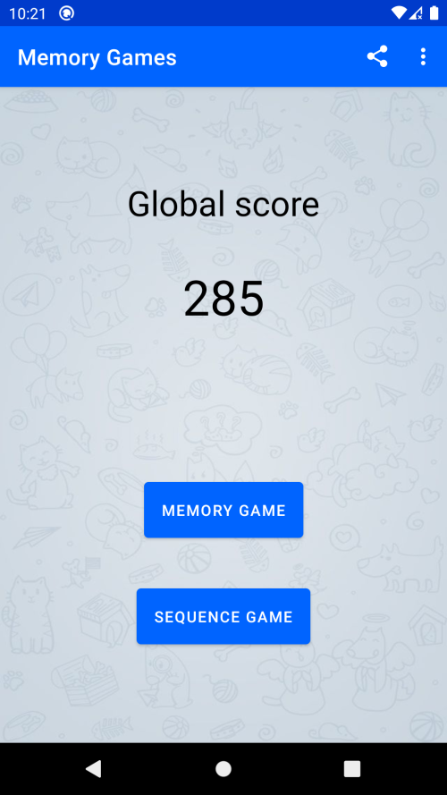
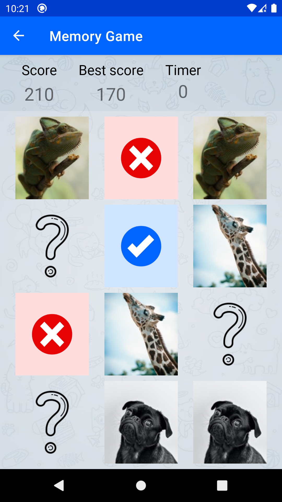
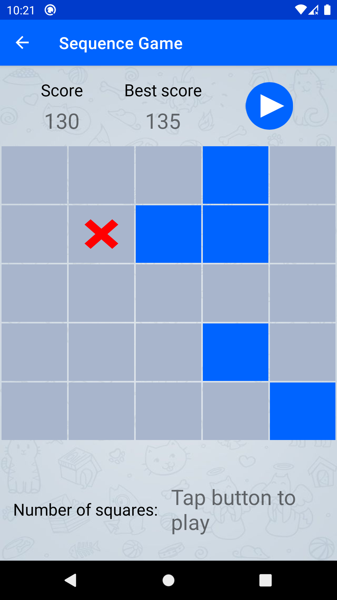

# Memory Games
Android application (using Kotlin) which consists on two games that can be used to train our memory, the more you play, the more complicated games will be. Here I'm just putting into practise what I've been learning about Mobile Development.
Some of the Android concepts used in this project are __Data Binding__, __Room Database__, __Navigation Component__, and Activity/Fragment __lifecycle__.

## Screenshots
  

## Contributing
Pull requests are welcome. For major changes, please open an issue first to discuss what you would like to change.

## License
[MIT](https://choosealicense.com/licenses/mit/)
